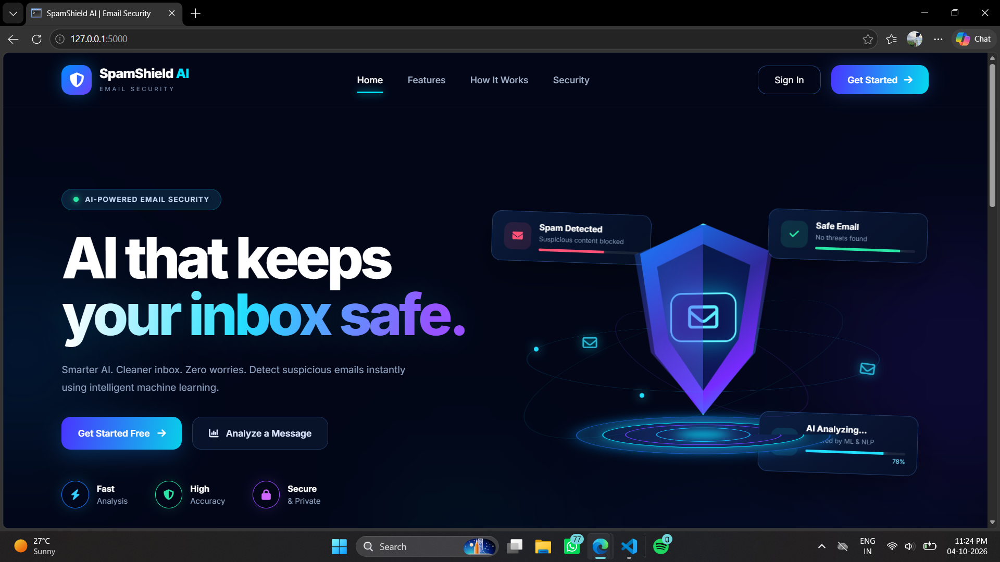
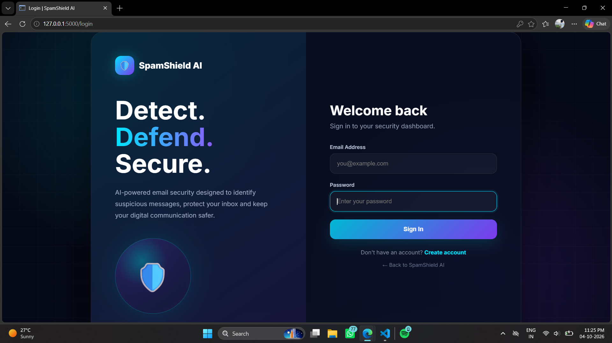
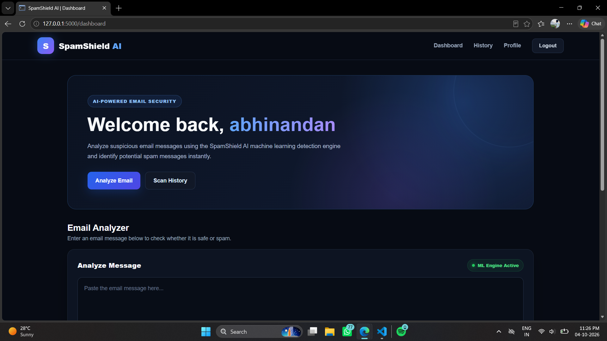

# 🛡️ SpamShield AI

## AI-Powered Spam Email Detection & Security Dashboard

**SpamShield AI** is a full-stack Spam Email Detection web application built using **Python, Flask, Scikit-learn, NLTK, Firebase Authentication and Cloud Firestore**.

The application uses **TF-IDF text features** and a **Logistic Regression classifier** to analyze messages and classify them as **Spam** or **Not Spam**.

---

# 🚀 Project Overview

SpamShield AI provides a secure and modern cybersecurity-style platform where users can:

- 🤖 Detect Spam / Not Spam messages
- 🧠 Use Machine Learning for text classification
- 📊 Analyze prediction confidence
- 🔐 Create secure accounts with Firebase Authentication
- 👤 Manage their profile
- 📜 View prediction history
- ☁️ Store prediction records in Firestore
- 👑 Access an Admin Dashboard
- 🛡️ Use protected Flask sessions
- 🚦 Benefit from rate limiting and input validation
- 📱 Use a responsive dark cybersecurity-style interface

---

# ✨ Features

| Feature | Description |
|---|---|
| 🤖 Spam Detection | Classifies messages as Spam or Not Spam |
| 🧠 Machine Learning | Logistic Regression classifier |
| 📊 TF-IDF | Converts text into ML features |
| 🔤 NLP | Text preprocessing using NLTK |
| 🔐 Firebase Authentication | Secure registration and login |
| 🛡️ Flask Sessions | Protected application sessions |
| ☁️ Firestore | Stores prediction history |
| 👤 User Profile | View and manage account information |
| ✏️ Profile Edit | Update user profile information |
| 👑 Admin Dashboard | Admin-level application monitoring |
| 📈 Evaluation | Accuracy, precision, recall and F1-score |
| 🚦 Rate Limiting | Helps protect API endpoints |
| 📱 Responsive UI | Desktop, tablet and mobile support |
| 🌙 Cybersecurity UI | Modern dark-themed interface |

---

# 🖥️ Application Screenshots

> **Important:** These are the exact screenshot locations on your Windows computer.
> Keep the images inside `A:\Spam_Email_Detector\ui_images\`.
> The exact path is shown first, followed immediately by the screenshot.

---

## 🏠 1. Home Page

**Image path:**

```text
A:\Spam_Email_Detector\ui_images\1.home.png
```

**Screenshot:**


**GitHub/project version:**



---

## 👤 2. Account Creation

**Image path:**

```text
A:\Spam_Email_Detector\ui_images\2. account create.png
```

**Screenshot:**


**GitHub/project version:**


---

## 🔐 3. Login Page

**Image path:**

```text
A:\Spam_Email_Detector\ui_images\3.login.png
```

**Screenshot:**


**GitHub/project version:**



---

## 📊 4. Dashboard

**Image path:**

```text
A:\Spam_Email_Detector\ui_images\4.dashboard.png
```

**Screenshot:**


**GitHub/project version:**



---

## 🔎 5. Analyze Message

**Image path:**

```text
A:\Spam_Email_Detector\ui_images\5.Analyze Message.png
```

**Screenshot:**


**GitHub/project version:**


---

## 📜 6. History Page

**Image path:**

```text
A:\Spam_Email_Detector\ui_images\6.History page 1.png
```

**Screenshot:**


**GitHub/project version:**


---

## 👤 8. Profile Edit

**Image path:**

```text
A:\Spam_Email_Detector\ui_images\8. profile edit.png
```

**Screenshot:**


**GitHub/project version:**


---

## 🔥 9. Firebase Datastore

**Image path:**

```text
A:\Spam_Email_Detector\ui_images\9.firebase datastore.png
```

**Screenshot:**


**GitHub/project version:**


---

### 📁 Required Folder Structure

```text
A:\Spam_Email_Detector\
│
├── README.md
│
└── ui_images\
    ├── 1.home.png
    ├── 2. account create.png
    ├── 3.login.png
    ├── 4.dashboard.png
    ├── 5.Analyze Message.png
    ├── 6.History page 1.png
    ├── 8. profile edit.png
    └── 9.firebase datastore.png
```

### ⚠️ Important for GitHub

The `A:\Spam_Email_Detector\...` path is only available on **your own computer**. GitHub cannot access your local `A:` drive.

For GitHub, upload the entire `ui_images` folder and keep these image references:

```markdown


```

> Your supplied list contains no `7.*` screenshot, so the README intentionally keeps the numbering as **1, 2, 3, 4, 5, 6, 8, 9**.

# 🧠 Machine Learning Pipeline

```text
📩 Input Message
      ↓
🧹 Text Preprocessing
      ↓
🔤 NLP Processing
      ↓
📊 TF-IDF
      ↓
🤖 Logistic Regression
      ↓
📈 Prediction
   ↙       ↘
🔴 SPAM   🟢 NOT SPAM
      ↘   ↙
   ☁️ Firestore
```

---

# 🏗️ System Architecture

```text
Browser
   ↓
HTML / CSS / JavaScript
   ↓
Firebase Authentication
   ↓
Flask Backend
   ↓
NLTK → TF-IDF → Logistic Regression
   ↓
Spam / Not Spam + Confidence
   ↓
Cloud Firestore Prediction History
```

---

# 🛠️ Technology Stack

### Frontend

```text
HTML5
CSS3
JavaScript
Jinja2 Templates
Font Awesome
Responsive Design
```

### Backend

```text
Python
Flask
Flask-Limiter
Jinja2
```

### Machine Learning

```text
Scikit-learn
TF-IDF
Logistic Regression
NLTK
Joblib
```

### Database & Authentication

```text
Firebase Authentication
Cloud Firestore
Firebase Admin SDK
```

---

# 📁 Project Structure

```text
Spam_Email_Detector/
│
├── dataset/spam.csv
├── model/spam_model.pkl
├── model/vectorizer.pkl
│
├── static/
│   ├── css/style.css
│   ├── js/script.js
│   ├── js/auth.js
│   ├── js/dashboard.js
│   └── images/logo.svg
│
├── templates/
│   ├── base.html
│   ├── index.html
│   ├── login.html
│   ├── register.html
│   ├── dashboard.html
│   ├── history.html
│   ├── profile.html
│   └── admin.html
│
├── ui_images/
│   ├── 1.home.png
│   ├── 2. account create.png
│   ├── 3.login.png
│   ├── 4.dashboard.png
│   ├── 5.Analyze Message.png
│   ├── 6.History page 1.png
│   ├── 8. profile edit.png
│   └── 9.firebase datastore.png
│
├── app.py
├── train_model.py
├── requirements.txt
├── firestore.rules
├── .env
├── .gitignore
├── README.md
└── serviceAccountKey.json
```

---

# ⚙️ Requirements

Python **3.11+** is recommended.

# 📦 Installation

```bash
python -m venv venv
```

### Windows

```bash
venv\Scripts\activate
```

### Linux / macOS

```bash
source venv/bin/activate
```

Install dependencies:

```bash
pip install -r requirements.txt
```

---

# 🔥 Firebase Setup

1. Create a Firebase project.
2. Enable **Authentication → Sign-in method → Email/Password**.
3. Create a **Cloud Firestore** database.
4. Go to **Project Settings → Your Apps → Web App** and copy the web configuration.
5. Go to **Project Settings → Service Accounts → Generate New Private Key**.
6. Save the downloaded key as `serviceAccountKey.json` in the project root.
7. Never commit that file to Git.
8. Set `ADMIN_EMAILS` to the email(s) that should receive the admin role.

Example `.env`:

```env
FLASK_SECRET_KEY=generate-a-long-random-secret
FIREBASE_WEB_API_KEY=...
FIREBASE_AUTH_DOMAIN=...
FIREBASE_PROJECT_ID=...
FIREBASE_STORAGE_BUCKET=...
FIREBASE_MESSAGING_SENDER_ID=...
FIREBASE_APP_ID=...
ADMIN_EMAILS=your-admin-email@example.com
```

---

# 📊 Dataset

Expected columns:

```text
label,message
```

The trainer also recognizes common alternatives such as `category`, `class`, `target`, `text`, `email` and `body`.

For meaningful real-world evaluation, use a larger, representative and properly licensed dataset.

---

# 🤖 Train the Model

```bash
python train_model.py
```

Creates:

```text
model/spam_model.pkl
model/vectorizer.pkl
```

---

# 🚀 Run

```bash
python app.py
```

Open:

```text
http://127.0.0.1:5000
```

---

# 👑 Admin

Register using an email listed in `ADMIN_EMAILS`. The first authenticated session for that account is stored with the admin role.

For stronger production deployments, use Firebase custom claims for admin authorization rather than an environment email allowlist.

---

# ☁️ Firestore Rules

Deploy the included rules with:

```bash
firebase deploy --only firestore:rules
```

The Flask server uses Firebase Admin SDK, so its server-side writes are not blocked by client Firestore rules.

---

# 🔒 Security

- Never expose `serviceAccountKey.json`.
- Never place service-account credentials in frontend JavaScript.
- Use HTTPS in production.
- Set a strong `FLASK_SECRET_KEY`.
- Restrict Firestore access.
- Replace the demo dataset before evaluating real-world performance.
- Use rate limiting and input validation.
- Do not treat the model as a definitive security control; combine it with normal email security controls for real systems.

---

# 🧪 Testing

Example normal message:

```text
Can you send me the project report after class?
```

Expected:

```text
🟢 NOT SPAM
```

Example suspicious message:

```text
You have been selected for an exclusive reward. Verify your information immediately.
```

Expected:

```text
🔴 SPAM
```

Recommended testing categories:

```text
📧 Personal messages
🎓 College messages
🛒 Shopping notifications
🏦 Financial messages
🎁 Fake rewards
💰 Investment scams
🔐 Phishing messages
📱 Promotional messages
```

---

# 🧰 Troubleshooting

### Model not found

```bash
python train_model.py
```

### Firebase authentication configuration missing

Check `.env` and make sure all Firebase Web App configuration values are present.

### Firestore unavailable

Check that `serviceAccountKey.json` exists and belongs to the same Firebase project.

### Admin page unavailable

Make sure the signed-in email is listed in `ADMIN_EMAILS`, then log out and sign in again.

### NLTK resource error

```python
import nltk
nltk.download("stopwords")
```

---

# 📈 Future Improvements

- 🔹 Larger training dataset
- 🔹 Advanced NLP models
- 🔹 BERT-based classification
- 🔹 URL phishing detection
- 🔹 Email attachment analysis
- 🔹 Real-time email scanning
- 🔹 Explainable AI predictions
- 🔹 Advanced admin analytics
- 🔹 User activity monitoring
- 🔹 Email API integration
- 🔹 Multi-language spam detection
- 🔹 Docker deployment
- 🔹 Cloud deployment

---

# 🎯 Project Objectives

- Detect spam messages automatically.
- Apply machine learning to text classification.
- Demonstrate NLP-based text processing.
- Build a secure full-stack web application.
- Store prediction history using Firestore.
- Implement Firebase-based authentication.
- Provide an administrator monitoring interface.
- Demonstrate practical use of Machine Learning and NLP.

---

# 🏆 Project Highlights

```text
              🛡️ SPAMSHIELD AI

          AI-Powered Email Security
                   │
      ┌────────────┼────────────┐
      ▼            ▼            ▼
  🤖 Machine    🔐 Secure     ☁️ Firebase
   Learning    Authentication  Firestore
      │            │            │
      └────────────┼────────────┘
                   ▼
            📊 Smart Dashboard
                   │
                   ▼
          🔴 Spam / 🟢 Not Spam
```

---

# 📚 Technologies Used

```text
🐍 Python
⚡ Flask
🧠 Scikit-learn
🔤 NLTK
📊 TF-IDF
🤖 Logistic Regression
📦 Joblib
🔥 Firebase Authentication
☁️ Cloud Firestore
🌐 HTML5
🎨 CSS3
⚙️ JavaScript
```

---

# ⚠️ Disclaimer

SpamShield AI is an educational and demonstration project.

The machine-learning classifier should **not** be treated as a definitive security control. Real-world email security should also use established anti-spam, phishing detection, malware scanning and authentication mechanisms.

---

# 👨‍💻 SpamShield AI

### Detect • Analyze • Protect

> **Turning Machine Learning into smarter email security.**

---

# ⭐ Support the Project

```text
⭐ Star the repository
🍴 Fork the repository
🐛 Report issues
💡 Suggest improvements
📢 Share the project
```

---

# 📸 Exact UI Image Paths

```text
A:\Spam_Email_Detector\ui_images\1.home.png
A:\Spam_Email_Detector\ui_images\2. account create.png
A:\Spam_Email_Detector\ui_images\3.login.png
A:\Spam_Email_Detector\ui_images\4.dashboard.png
A:\Spam_Email_Detector\ui_images\5.Analyze Message.png
A:\Spam_Email_Detector\ui_images\6.History page 1.png
A:\Spam_Email_Detector\ui_images\8. profile edit.png
A:\Spam_Email_Detector\ui_images\9.firebase datastore.png
```
